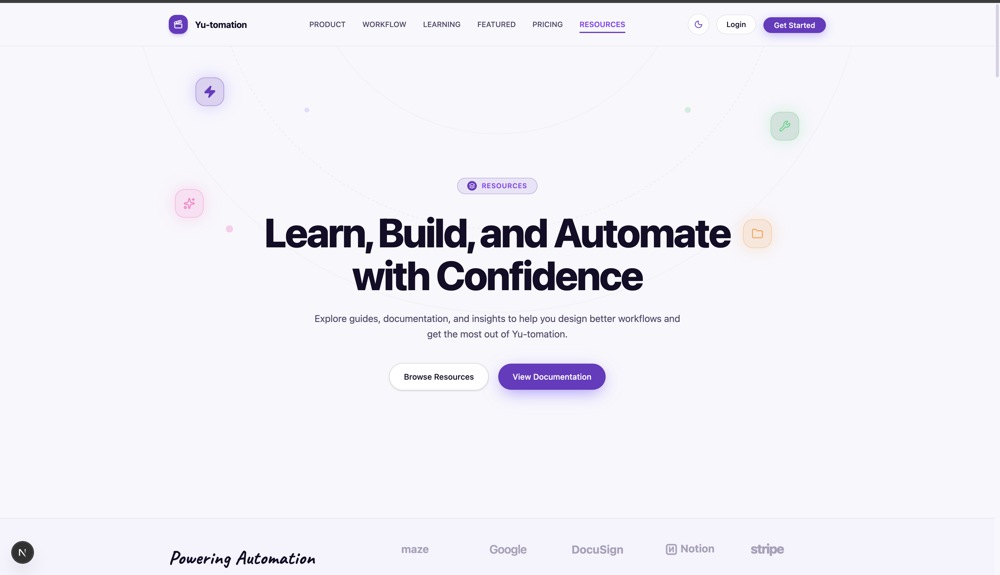
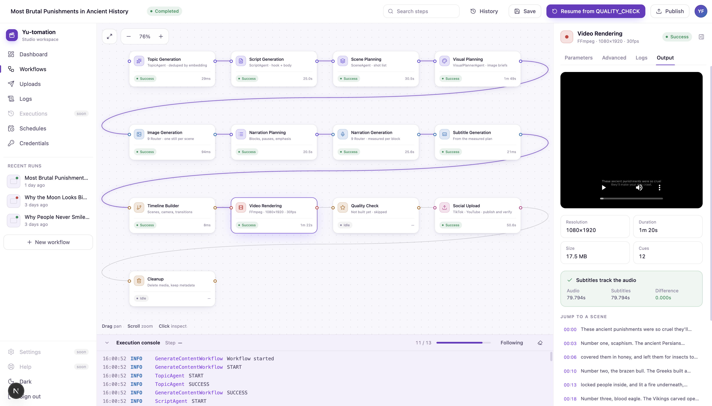
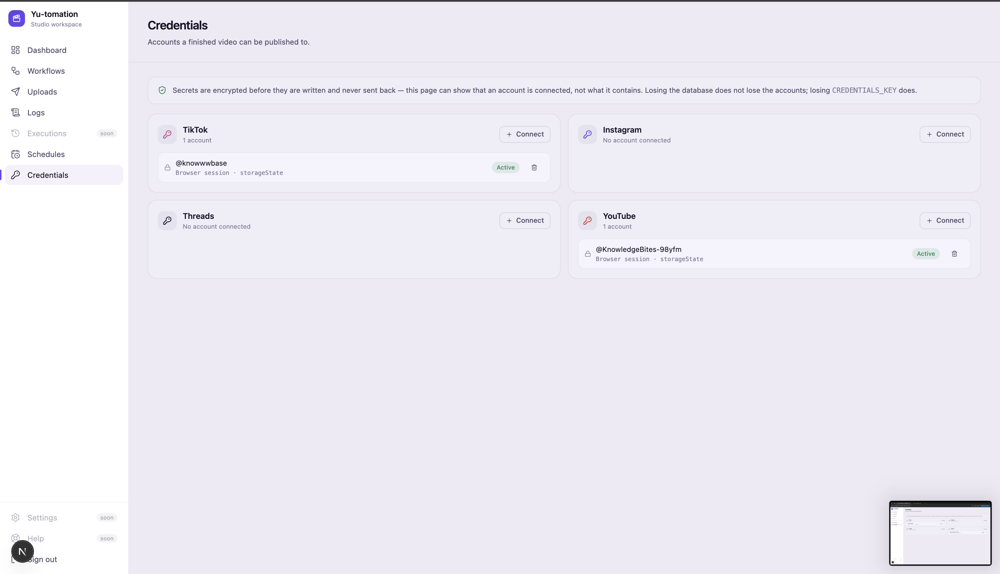

# Yu-tomation

Short-form video, made and published without a person in the loop. Give it a
subject — or let it find one — and it writes the script, plans the shots,
generates the stills, speaks the narration, times the captions, renders the
video and posts it to TikTok and YouTube.



| Directory                | What it is                                                            |
| ------------------------ | --------------------------------------------------------------------- |
| [`backend/`](backend/)   | The pipeline and its HTTP API — topic to finished `final.mp4`.        |
| [`frontend/`](frontend/) | The editor: a node canvas for a run, with manual recovery and resume. |

**Stateless media, stateful knowledge.** Generated files are disposable; topics,
scripts, scene plans, workflow state, published URLs and logs are permanent.
A run's video is deleted once it is published; what it *was* is not.

---

## What a run does

Eleven steps, each recorded on its own so a run that dies halfway resumes from
where it stopped rather than from the beginning.

| Step                    | What comes out of it                                        |
| ----------------------- | ----------------------------------------------------------- |
| **Topic**               | A subject nothing else has covered, checked against history. |
| **Script**              | Hook, narration, caption, hashtags.                          |
| **Scene planning**      | A shot list with per-scene timings.                          |
| **Visual planning**     | One fully specified image brief per scene.                   |
| **Image generation**    | A still per scene, or the ones you uploaded by hand.         |
| **Narration planning**  | The script split into timed blocks with pauses.              |
| **Voice**               | Each block spoken separately and *measured*, not estimated.  |
| **Subtitles**           | Cues timed against the measured audio, so they cannot drift. |
| **Timeline**            | Camera moves, transitions, the explicit render plan.         |
| **Render**              | `final.mp4` — 1080×1920, burned-in captions, cover chosen.   |
| **Upload**              | Published to every connected account, with the URL recorded. |

The editor shows all of it as it happens, and lets you take over any step that
went wrong.



Panels worth knowing:

- **Canvas** — one card per step, with its status and how long it took. A
  running step wears a moving ring; a failed one says which error code.
- **Inspector** — parameters, logs and output per step. The render step plays
  the video and proves the subtitles match the audio to the millisecond.
- **Execution console** — the run's log, following the tail until you scroll up.
- **Recent runs** — in the sidebar on every page, five deep.

Light and dark both ship; the toggle is at the bottom of the sidebar and the
choice follows your system until you touch it.

---

## Publishing

Accounts live under **Credentials**. Secrets are sealed with AES-256-GCM before
they are written and are never sent back — the page can show that an account is
connected, never what it holds.



Two ways in, per platform:

- **Browser session** — sign in once in a real browser and the session is
  captured. Either press *Open a browser and sign in*, or run
  `pnpm tiktok:login` / `pnpm youtube:login` and paste the file. A cookie export
  or a `Cookie:` header from DevTools is accepted too — cookies that are not
  signed in are refused at the door rather than failing next week.
- **Official API** — OAuth fields, for when the platform's own posting API is
  available to you.

A run publishes to every account that is *enabled*. With none, the step is
skipped and the run still finishes — a video with nowhere to go is not a
failure. Failed and partial uploads are listed alongside successes under
**Uploads**, where you can also fill in a URL by hand, correct a status, or
record a publish you did yourself.

> Publishing through a browser is against TikTok's and YouTube's terms of
> service. That is your call to make, and the official-API route exists for when
> it is not.

---

## Run the whole thing

Requires Docker with `docker-compose` (v2 or newer). Nothing else — no Node, no
pnpm, no PostgreSQL on the host.

### 1. Configure the two env files

```bash
cp backend/.env.example backend/.env
cp frontend/.env.example frontend/.env.local
```

Then fill in `backend/.env`. The values without which nothing runs:

| Variable                  | Meaning                                        |
| ------------------------- | ---------------------------------------------- |
| `NINE_ROUTER_API_KEY`     | Key for your 9 Router. Never commit it.        |
| `NINE_ROUTER_TEXT_COMBO`  | Combo used for text, e.g. `opus`.              |
| `NINE_ROUTER_IMAGE_COMBO` | Combo used for images.                         |
| `ROUTER_SPEECH_API_KEY`   | Key for text-to-speech. The narration needs it.|
| `CREDENTIALS_KEY`         | Encrypts stored publishing accounts at rest.   |

Worth setting once you are past the first run:

| Variable                        | What it decides                                    |
| ------------------------------- | -------------------------------------------------- |
| `PIPELINE_LAST_STEP`            | How far a run goes. `UPLOAD` publishes; `COMPOSE` stops at the video. |
| `VIDEO_SUBTITLE_BOTTOM_FRACTION`| How far the captions sit above the bottom edge.    |
| `VIDEO_COVER_AT_FRACTION`       | Which still becomes the cover, as a fraction through. |
| `TIKTOK_MAX_HASHTAGS`           | How many hashtags travel to TikTok. Default 5.     |
| `YOUTUBE_MADE_FOR_KIDS`         | A legal declaration, not a preference. See the note in `.env`. |

`DATABASE_URL` is the one variable you can leave alone: Compose overrides it with
the address of the database it starts. Everything else in that file is read as
written.

In `frontend/.env.local`, set `APP_PASSWORD` (the workspace sign-in) and
`AUTH_SECRET` (signs the session cookie), and copy the three `ROUTER_SPEECH_*`
values from `backend/.env` so the voice previews work. `YU_BACKEND_URL` and
`YU_MEDIA_ROOT` in that file are for running the editor on the host; Compose
overrides both, so whatever they say is ignored inside the containers.

### 2. Up

```bash
docker-compose up -d --build
```

That builds both images, starts PostgreSQL, applies the migrations, serves the
API and serves the editor:

| Service    | Where                                              |
| ---------- | -------------------------------------------------- |
| Editor     | <http://localhost:3000>                            |
| API        | <http://localhost:4000> (`/api/health` says `ok`)  |
| PostgreSQL | `localhost:5432`                                    |

The first build takes a few minutes — FFmpeg for the backend image, the Next
build for the editor. Later ones are mostly cache.

### 3. Watch it work

```bash
docker-compose ps                  # what is up, and whether it is healthy
docker-compose logs -f backend     # what a run is actually doing
docker-compose logs -f frontend
```

### 4. Down

```bash
docker-compose down          # stop everything; the database survives
docker-compose down -v       # …and throw the database and media away too
```

---

## How the pieces are wired

```
frontend  ──HTTP──▶  backend  ──SQL──▶  postgres
    │                   │
    └──── media-scratch ┘        shared volume: images, narration, final.mp4
```

- **`postgres`** — `pgvector/pgvector:pg17`, because the topic embeddings need
  the `vector` extension.
- **`migrate`** — runs `prisma migrate deploy` once and exits. The API waits for
  it to succeed, so a schema that fails to apply is reported as itself rather
  than as an API that will not start.
- **`backend`** — `node dist/main.js serve`: the HTTP API plus the scheduler
  tick. Media is written to `/app/output` on the shared volume.
- **`frontend`** — `next start`. Reaches the API at `http://backend:4000` and
  reads the same media volume at `/media`, which is how a still can be replaced
  by hand from the editor.

Ports and database credentials come from the root `.env` — see
[`.env.example`](.env.example). Application settings do not live there: each half
keeps reading the env file it already uses, so a value means the same thing with
Docker and without.

Two things about that file are worth knowing before they bite:

- **The database keeps the password it was created with.** PostgreSQL ignores
  `POSTGRES_PASSWORD` once its volume exists, so the credentials here must match
  the ones in `backend/.env`. They already do — change them together or not at
  all.
- **Ports are the host side only.** Inside the network the services always talk
  on 4000, 5432 and 3000, whatever you map them to outside.

---

## Working on the code instead

The stack above is for running the product. To develop either half, run its
database in Docker and the app on the host:

```bash
cd backend && pnpm install && pnpm db:up && pnpm db:migrate && pnpm serve
cd frontend && pnpm install && pnpm dev
```

Useful commands while you are in there:

| Command               | What it does                                                |
| --------------------- | ----------------------------------------------------------- |
| `pnpm verify`         | Lint, typecheck and the whole test suite.                    |
| `pnpm tiktok:login`   | Opens a browser, captures a TikTok session to `output/`.     |
| `pnpm youtube:login`  | The same for YouTube.                                        |
| `pnpm audio:backfill` | Records narration metadata for runs made before it existed.  |
| `pnpm db:studio`      | Prisma Studio against the running database.                  |

`backend/docker-compose.yml` starts only PostgreSQL, on the same volume the full
stack uses, so the data follows you between the two ways of working. Only one of
them can hold the database container at a time — `docker-compose down` in the
root before `pnpm db:up`, and the other way round.

Details, architecture and the pipeline itself: [`backend/README.md`](backend/README.md),
[`backend/ARCHITECTURE.md`](backend/ARCHITECTURE.md) and
[`frontend/README.md`](frontend/README.md).

---

## Known limits inside Docker

- **Publishing needs a browser.** The TikTok and YouTube steps drive Playwright,
  and the backend image ships no browsers. Uploads are skipped unless
  `TIKTOK_UPLOAD_URL` / `YOUTUBE_UPLOAD_URL` are set, and capturing a session
  (`pnpm tiktok:login`) is a host-side job — it needs a window to sign in.
- **Media lives in a volume, not the repository.** `docker-compose down -v`
  deletes it, which is the intended lifecycle: the metadata in PostgreSQL is
  what survives a run.
- **Sign in over `localhost`, not a bare LAN address.** The session cookie is
  marked `Secure` in production, and browsers accept that over plain HTTP only
  for `localhost`. Reaching the editor from another machine means putting TLS in
  front of it.
